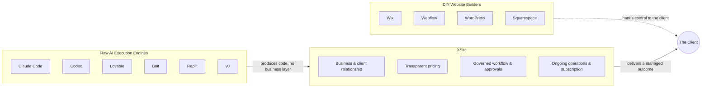
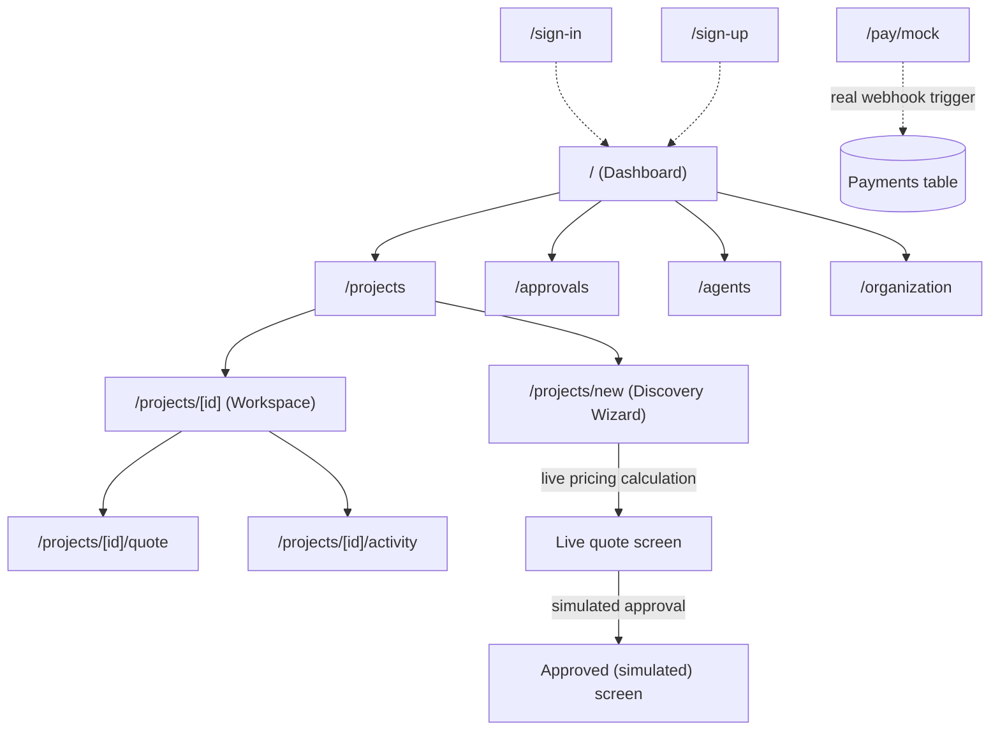
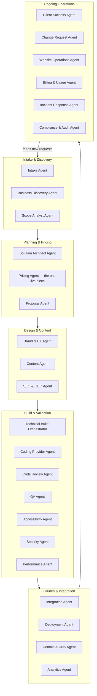
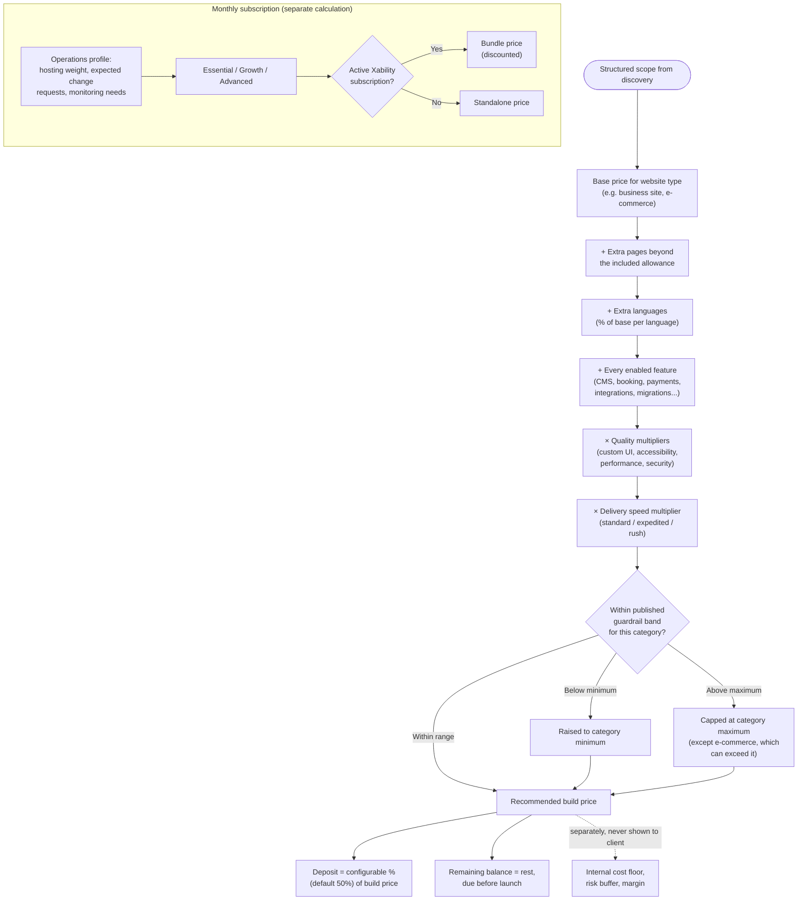
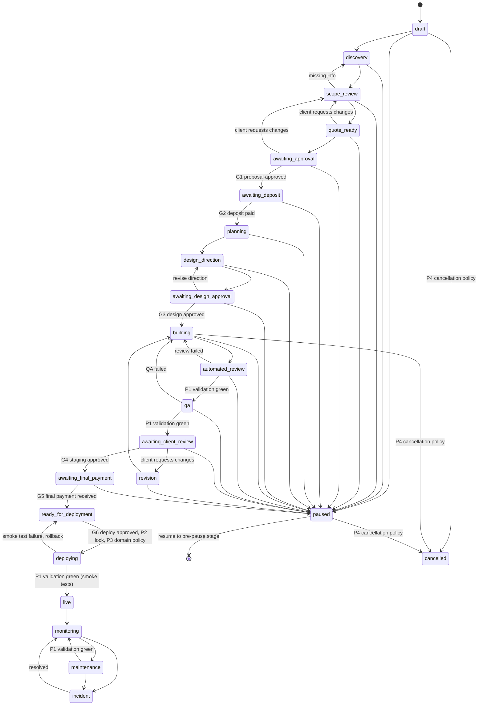
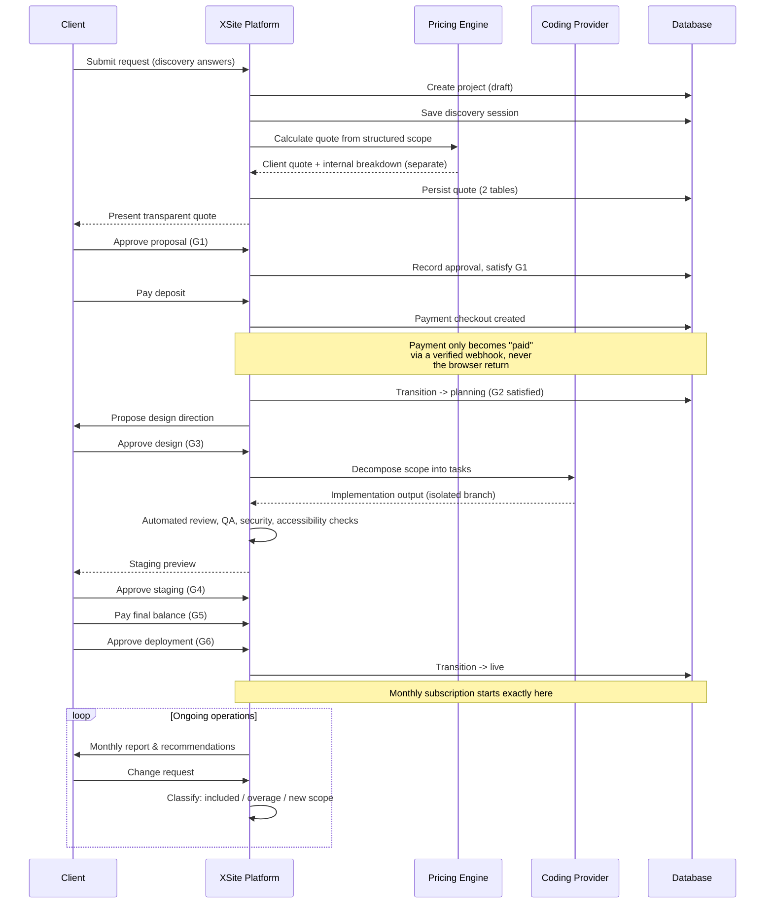
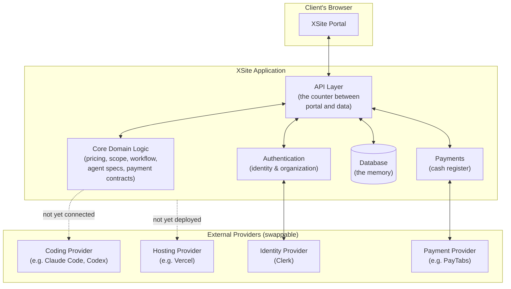
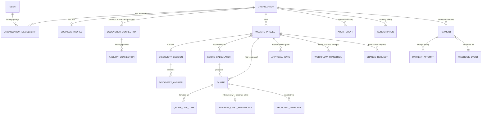
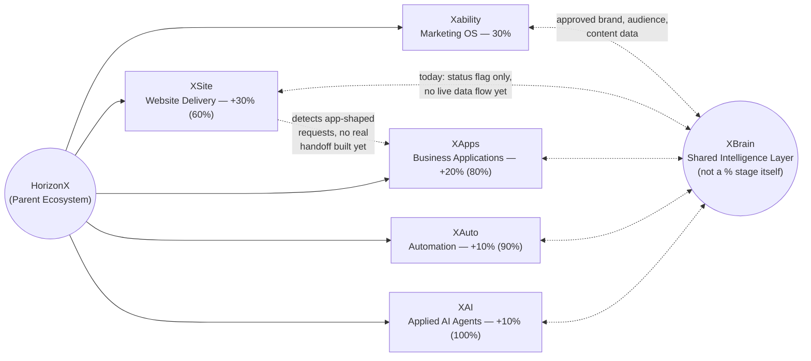

# XSite Product Handover

**Prepared for:** Abdelrhman (Founder) and the HorizonX product team
**Prepared by:** Engineering (AI-assisted build)
**Date:** July 2026
**Scope:** Complete product handover of XSite as it exists at the end of the Phase 1.5 production-readiness milestone

**Purpose of this document.** This is not a marketing document and not a code walkthrough. It is a complete, honest, product-level explanation of what XSite is, why it exists, how it works today, what it does not yet do, and what should happen next — written so that a founder, a new product manager, or a new engineer can read it once and understand the entire system without opening a single source file.

---

## Executive Summary

XSite is HorizonX's AI-managed website delivery and operations platform. It exists to take a business's raw need — "I need a website" — and carry it through a complete, accountable lifecycle: guided discovery, a transparent and explainable price quote, a deposit, a managed build process with real approval checkpoints, a launch, and then an ongoing monthly subscription that keeps the site monitored, maintained, and improved. The client never operates a page builder. They answer questions, review decisions, and approve gates; XSite (and the AI-operated agent system behind it) does the rest.

XSite is the second pillar of HorizonX's Digitalization Index, sitting directly after Xability (marketing) and before XApps, XAuto, and XAI. Its job is not to compete with website builders like Wix or Webflow, and not to compete with AI coding tools like Claude Code or v0 — it is the business and operations layer that could use any of those tools as interchangeable execution engines while owning the client relationship, the pricing, the workflow, and the ongoing accountability that none of those tools provide on their own.

**Where the product actually stands today**, stated plainly and without spin: XSite has a genuinely production-grade *business logic core* — a real, tested pricing engine; a real, tested, enforced workflow state machine with 23 states and hard approval gates; a real, tested multi-tenant database with airtight tenant isolation; a real payment architecture where a browser can never fake a successful payment; and a fully specified (but not yet running) system of 26 AI agents that will eventually operate the platform autonomously. What XSite does **not** yet have is any mechanism that actually builds a website for a client — no coding provider is wired in, no agent actually executes anything today — and the client-facing screens in the portal are still showing fixed demonstration data rather than being connected to the real, tested backend that already exists underneath them. Three external accounts (a Vercel deployment, a Clerk authentication application, and a PayTabs merchant account) also need to be created by a human before any of this can go live for a real client.

In short: XSite today is the fully engineered skeleton and nervous system of a real product, with the correct bones in exactly the right places, but no muscles attached yet and no blood flowing through it. The single most important next step — covered in detail at the end of this document — is not to add more features, but to connect what already exists into one real, working, end-to-end journey that a real person could actually walk through on a live URL.

---

## Vision

XSite exists to solve a problem that has never actually been solved well: getting a business a website that is priced fairly, delivered predictably, and *kept working* afterward, without requiring the business owner to become a part-time web developer or gamble on an unaccountable freelancer.

Every existing option asks the business to take on risk it shouldn't have to take. Do-it-yourself builders (Wix, Squarespace, Webflow, WordPress) hand the business a tool, not a result — the business still has to design pages, write copy, keep plugins updated, and notice when something breaks, forever, or pay someone else to do that work on top of the platform fee. Agencies and freelancers take on the building, but pricing is often opaque and negotiated case-by-case, timelines slip without recourse, and — critically — once the invoice is paid and the site is handed over, there is usually no ongoing relationship at all. If the site breaks, if search rankings fall, if the business needs a new page, they are back to square one, hunting for help.

XSite's vision is to be the accountable middle layer that neither of those options provides: a system that behaves like a competent, trustworthy digital project manager for the entire life of a website — from the very first conversation about what the business needs, through a transparent, itemized price, through a managed build with real checkpoints the client can see and approve, through launch, and then continuously afterward, as an ongoing subscription that includes monitoring, search optimization, integration health, and a clear, bounded way to request changes without ever facing a surprise bill.

XSite exists inside HorizonX specifically because HorizonX's broader vision is that a business becomes progressively and measurably "digitalized" across a defined set of pillars, each owned by a dedicated HorizonX product. Xability, the first pillar, already understands a business's brand voice, its audience, its marketing content, and its campaigns. A website is the natural, necessary second pillar — the business's digital storefront — and it should never have to be built in a vacuum, disconnected from everything Xability already knows about that business. XSite exists specifically to be that second pillar, and to be built from day one so it can reuse what Xability already has rather than making the client repeat themselves to a second, disconnected HorizonX product.

XSite is explicitly **not** a website builder and explicitly **not** an AI coding tool. It does not compete with Wix, Webflow, WordPress, Squarespace, or any no-code platform, because those platforms hand control (and the burden of building) to the client — XSite's entire premise is that the client should never have to build anything themselves. And it does not compete with Claude Code, Codex, Lovable, Bolt, Replit, or v0, because those are execution engines with no business logic wrapped around them at all — no discovery process, no pricing, no client accounts, no ongoing operations. XSite is designed from the ground up to be able to use any of those tools (or several of them, or their eventual successors) as a replaceable "Coding Provider" behind an adapter, while XSite itself remains the permanent thing: the business relationship, the price, the workflow, the accountability, and the ongoing operation of the site once it's live.

---

## Product Philosophy

Three deliberate philosophical choices shaped every decision made in building XSite so far, and they are worth stating explicitly because they explain *why* the system looks the way it does rather than looking like a simpler, more obvious alternative.

### 1. Workflow-driven, not generator-driven

It would have been far simpler to build XSite as "describe your business, get a generated website." That is what most AI website tools do today, and it is precisely the category XSite deliberately avoids. A generator produces an artifact and stops caring about it. XSite instead has to answer, continuously, for the entire life of a client relationship: *what is happening right now, what is waiting on the client, what has already been approved, what will cost money if approved, and what can still be reversed.* A website project involves real money changing hands (a deposit, a final payment, a recurring subscription), a real commitment of time and scope, and a client who is very often not technical and cannot personally evaluate whether "the AI did a good job." All of that requires explicit checkpoints — approval gates — not a single prompt-to-output pipeline that trusts the client to catch problems after the fact. This is why XSite's architecture is built around a formal workflow engine with enforced states and gates (explained in full later in this document) rather than around a single "generate the site" button.

### 2. Explainable over magical

XSite's pricing engine is deliberately, architecturally *not* machine learning, and is never allowed to be described as artificial intelligence deciding a price. It is a transparent, rules-based formula: every dollar in a client's quote can be traced back to a specific, labeled line item with a plain-English reason attached to it. This was a conscious choice for two reasons. First, trust: a small business owner cannot meaningfully evaluate an opaque "the algorithm decided $1,500" the way they can evaluate "$400 base price, plus $270 for six additional pages, plus $350 for a content management system, plus a 15% premium for custom design work." Second, control: HorizonX itself needs to be able to explain, defend, and adjust its own pricing logic without needing to retrain a model or guess at what it will output next. Every part of XSite that makes a consequential decision — the pricing engine, the scope classification engine, the workflow state machine — is built the same way: as explicit, inspectable rules rather than opaque inference, specifically so both the client and HorizonX can always ask "why" and get a real answer.

### 3. Provider-agnostic by design

AI coding, reasoning, and design models are improving and turning over on a timescale of months, not years. If XSite had been built "on top of Claude Code" or "on top of GPT" as its foundational architecture, it would already be at risk of obsolescence the moment a meaningfully better tool arrived, because the business logic and the execution engine would be tangled together. Instead, XSite is built so that the workflow, the pricing, the client relationship, and the accountability structure are the permanent asset, and *any* AI tool that actually writes code, drafts content, or generates a design sits behind a formal adapter interface that XSite defines — described in this document as a "Coding Provider," a "Content Provider," a "Design Provider," and so on. Swapping Claude Code for Codex, or for whatever tool exists in two years, should never require touching the pricing engine, the workflow engine, or the client-facing experience at all.

A fourth, more operational principle threads through all of this: **honesty is enforced architecturally, not just written down as a value.** Every capability in XSite carries an explicit status — Available, Simulated, Planned, or Requires Integration — and that status is a real, structural property of the system, not just a comment in a document. The database that stores a client's price quote is physically incapable of also returning HorizonX's internal cost estimates and profit margin to that same client, because those two things live in separate database tables with no code path connecting them — it is not a matter of "the API happens not to include that field today," it is a matter of "there is no way to reach that data from anything a client can call." This was a deliberate defense against the single most common failure mode in fast-moving software teams: a demo or a shortcut quietly becoming "the real thing" in production because nobody explicitly decided that it should.

---

## Problems XSite Solves

Stated directly, without embellishment, XSite exists to solve five specific, concrete problems:

1. **Unpredictable, unexplained pricing.** Businesses shopping for a website today typically get either a fixed, generic platform subscription fee that has nothing to do with the actual complexity of what they need, or a custom freelancer/agency quote that is negotiated case-by-case with no visible logic behind it. XSite replaces both with one formula, applied consistently to every client, that produces a fully itemized price the client can actually read and understand.

2. **No accountability after handoff.** Once a freelancer or agency delivers a website, the relationship typically ends. If the site breaks, if a plugin becomes outdated, if search visibility drops, the business is on its own again. XSite is built around a recurring subscription specifically because the job is not "deliver a website," it is "keep a website working, secure, and effective," continuously.

3. **The technical burden falls on the wrong person.** DIY builders ask a business owner — someone who runs a restaurant, a clinic, a consultancy — to also become a competent web designer, copywriter, and IT administrator. XSite is built so that the client's only job is to answer questions and make decisions; the technical execution is entirely XSite's responsibility.

4. **No system for bounded, ongoing change.** After a website is live, a business will inevitably want small changes — a new page, updated hours, a new promotion. Today that either means going back to whoever built the site (if they're still reachable) or fumbling with a builder tool. XSite defines an explicit, bounded system for this: a fixed monthly allowance of small/medium changes included in the subscription, with anything beyond that allowance quoted and approved before any work happens — so a business never faces either "no way to get this done" or "an unpredictable surprise invoice."

5. **Disconnection between a business's marketing identity and its website.** A business that already has an active brand voice, content library, and audience data in Xability should never have to explain who they are, what they sell, and how they sound from scratch to a second system. XSite is built specifically so that this data — once the client explicitly approves reusing it — can flow into the website process instead of being re-collected.

---

## Target Customers

XSite's primary customer is a small-to-mid-size business or professional practice, most immediately across Jordan and the wider MENA region (reflecting HorizonX's home market and the payment infrastructure decisions made in this milestone), that needs a professional, functioning website but does not have in-house technical or design capability and does not want to manage a website builder themselves. Illustrative examples used as design references throughout this build include a business consultancy, a restaurant needing a bookings-capable site, a clinic, and a real-estate brokerage — businesses that need to look credible and be found online, but whose core competency is not websites.

A secondary, closely related customer is any business that already uses Xability for its marketing and is a natural candidate to add a website as its next digitalization step — for these clients, XSite is positioned partly as a bundled add-on (with bundle pricing built into the pricing engine from day one) rather than a cold, standalone purchase.

XSite explicitly does not target enterprises needing complex, multi-role internal software, marketplaces, or ERP/CRM-scale systems — the product's own scope-detection logic is specifically designed to notice when an incoming request looks like one of those and flag it for eventual handoff to XApps rather than attempting to force it through XSite's website-shaped process.

---

## Competitive Positioning

XSite sits in a category of its own: it is neither a tool the client operates, nor a raw execution engine with no business layer. It is the accountable service layer that can *use* either category as a component while owning none of the client's technical burden.

### XSite vs Wix

Wix is a do-it-yourself website builder: the business signs up, picks a template, and does the actual building — dragging blocks, writing text, configuring settings — themselves, on an ongoing basis, for as long as they use the platform. Wix's revenue model is a subscription for *access to the tool*. XSite's model is a delivered outcome plus a managed subscription: the client never opens a builder interface at all. They go through discovery, receive a quote, approve a design direction, review a staging version of the finished site, and approve launch — the actual construction is never their responsibility. Where Wix succeeds is exactly where a client wants to do the work themselves and is comfortable with ongoing DIY maintenance; XSite exists for the much larger segment of businesses who explicitly do not want that responsibility.

### XSite vs Webflow

Webflow is a more design-and-developer-oriented builder than Wix, popular with agencies and technically sophisticated users because of its visual, near-code-level control over markup and styling. It still requires someone — the business or an agency they've hired — to actually operate the tool. XSite's relationship to Webflow is the same in kind as its relationship to Wix: Webflow is a tool a human operates to produce a site; XSite is a service that produces the site *for* the client and then keeps operating it. It's plausible that a future Coding Provider adapter behind XSite could, in principle, use a tool like Webflow's APIs as one execution option — but the client interacting with XSite would never know or care, which is precisely the point of the provider-agnostic design described earlier.

### XSite vs WordPress

WordPress is different in kind from Wix and Webflow in that it is open-source software the business (or their agency/freelancer) self-hosts and maintains — meaning the business also inherits security patching, plugin compatibility, backups, and hosting management, either directly or by paying someone else to handle it indefinitely. This is precisely the "no accountability after handoff, technical burden on the wrong person" problem XSite exists to solve. Where a WordPress site can silently degrade over months of unmanaged plugin drift and abandoned maintenance, XSite's monthly subscription explicitly includes ongoing monitoring, security maintenance, and backups as a first-class, always-on part of the product, not an optional extra a client has to remember to arrange.

### XSite vs Claude Code

Claude Code is a coding agent — an extraordinarily capable tool for writing, editing, and reasoning about code inside a development environment, directed by a developer or a technical agent with a specific engineering task. It has no concept of a client, a business, a quote, a deposit, an approval gate, or an ongoing subscription — it is not trying to have one, because that is not its job. XSite's "Coding Provider Agent" role is specifically designed so that a tool exactly like Claude Code could be the thing that actually writes a client's website code, once Phase 2 wires that adapter in. XSite is the business wrapped around that execution capability, not a competing way to write code.

### XSite vs Codex

The same relationship applies to OpenAI's Codex-family coding tools: they are a second, equally valid execution engine XSite's provider-selection system is explicitly designed to be able to choose between (based on cost, quality, task fit, and availability) or fail over to if one becomes unavailable. XSite's architecture treats Claude Code and Codex as functionally interchangeable options behind the same interface — neither is "the" engine XSite depends on, and today, notably, *neither has actually been wired in yet* (see Current Limitations).

### XSite vs Lovable

Lovable is closer to XSite's problem space than Claude Code or Codex, in that it markets itself toward non-technical users describing what they want and getting a generated app or site back — but it remains fundamentally a generator: the user gets an artifact, and the ongoing relationship (if any) is "keep using the tool to keep editing the output yourself." There is no discovery-to-quote-to-approval-to-launch-to-operations lifecycle, no multi-tenant client account management, and no bundled ongoing SEO/monitoring/change-management subscription. XSite's differentiation is the entire structured lifecycle around the build, not the build step itself.

### XSite vs Bolt

Bolt occupies a similar space to Lovable — an AI-assisted, prompt-driven builder aimed at quickly producing a working app or site, typically for developers or technically curious users iterating quickly. Like Lovable, it is a generation tool without a business process wrapped around it. XSite's relationship to Bolt is again that of a potential future execution option behind an adapter, never a direct competitor for the same customer relationship.

### XSite vs Replit

Replit is a full development environment with AI-assisted coding (Replit Agent) built in, oriented toward building and hosting applications, aimed primarily at developers and increasingly at less technical builders. It is closer to a platform for building and running software than a client-facing delivery service. XSite does not compete with Replit's hosting/runtime capability directly — a future `HostingProvider` adapter in XSite's architecture could, in principle, use a platform like Replit as one hosting option — but Replit has no concept of a client-facing quote, approval workflow, or ongoing managed subscription.

### XSite vs v0

v0 (from Vercel) is a tool for generating UI components and pages from a prompt or design reference, primarily useful to developers assembling a frontend quickly. It is the narrowest of the tools discussed here in scope — a component/page generator, not a full website production system, and entirely without any business or client-management layer. XSite's Brand & UX Agent and Content Agent roles could, in a future phase, use a tool like v0 as one design-generation option behind the Design Provider adapter — but again, this is a potential subcontractor relationship, not competition for the same customer.

---

## Current Product Walkthrough

This section describes, page by page, what a user would actually see in the XSite portal today, and — critically — what is really happening behind each screen versus what appears to be happening. This is the most important section for setting accurate expectations, because the portal is visually complete and convincing, but several of its screens are running on fixed sample data rather than the real backend.

**Dashboard (`/`).** The first screen a client sees after signing in. It shows the organization's name, a list of projects with their current status, a "waiting for you" section highlighting anything pending a decision, and a short summary of the organization's connection to Xability. Behind the scenes, everything on this page is fixed, hand-authored sample data (an organization called "Al Noor Consulting (Demo)" with two example projects) — there is no database query happening when this page loads. It is a faithful mock-up of what the real dashboard should look like once connected to live data, clearly labeled as demo content.

**Websites list (`/projects`).** A table of every website project for the organization, with its type, status, build price, and monthly plan. Same situation as the dashboard: real-looking, fixed sample data, not a live query.

**New website request / discovery wizard (`/projects/new`).** This is the one screen in the entire portal where something genuinely real happens. A short guided form asks about the business's goal, industry, page count, and needs (payments, bookings, a members area, and so on). As the user answers, the system's real scope-classification logic recommends a website type live, in the browser. When the user reaches the end of the wizard, it sends the collected answers to a real API endpoint that runs the actual, production pricing engine and returns a genuinely calculated, fully itemized quote — the numbers on screen are not fake. What is *not* real yet: nothing about this session is saved anywhere. If the browser is closed, the quote is gone. Clicking "approve" at the end shows a simulated confirmation screen explaining, honestly, that in a live system this step would collect a deposit and create a persistent project — it does not actually do so today.

**Project workspace (`/projects/[id]`, `/projects/[id]/quote`, `/projects/[id]/activity`).** These three pages show a single project's timeline (visualized against the real, defined workflow states), its quote in full detail, and its audit history. All three are populated from the same fixed sample data as the dashboard — the "activity" page, in particular, shows a hand-authored sequence of audit events meant to *look like* what a real audit trail across a project's life would contain, but none of it was actually generated by the system acting on a real project.

**Approval center (`/approvals`).** A cross-project list of anything currently waiting on a client decision, plus a reference list explaining every approval and policy gate in the system. The gate list itself is real, live documentation of the actual enforced rules; the "things waiting for you" list above it is sample data.

**Agent catalog (`/agents`).** This page is worth calling out specifically because it behaves differently from the rest of the portal: it is reading the *actual, real* internal specification of all 26 AI agents — their responsibilities, permissions, failure behavior, and current implementation status — directly from the same data structure the rest of the system would eventually use to run them. It is not sample data dressed up to look real; it is a genuine, honest window into the system's real governance design. What it does *not* do is show any agent actually doing anything, because none of them run yet.

**Organization & ecosystem connections (`/organization`).** Shows the business profile and a list of HorizonX ecosystem connections (Xability, XApps, XAuto, XAI) with status indicators. Fixed sample data, honestly labeled.

**Sign-in / sign-up (`/sign-in`, `/sign-up`).** These pages contain a real, working integration with Clerk (the authentication provider) — the actual sign-in and sign-up components render and would function correctly the moment a real Clerk account exists. Until then, because no Clerk account has been created, these pages display a plain message explaining that authentication isn't configured in this environment yet, rather than pretending to work.

**Mock payment screen (`/pay/mock`).** This is the second screen, alongside the discovery wizard, where something fully real happens end to end. It exists purely as a stand-in for a real hosted payment page. Clicking "simulate successful payment" does not directly mark anything as paid in the browser — instead, it sends a message to the exact same server endpoint a real payment company's system would call, which is the only place in the entire system authorized to change a payment's status. This was deliberately built this way, and verified working, specifically to prove that the "a browser can never fake a payment" rule holds even in the sandbox version of the system.

**Health check (`/api/health`, not a visible page but worth noting here).** A machine-readable status endpoint that honestly reports whether the environment has everything it needs configured (a live database connection string, real authentication keys, a real payment provider) — and currently, correctly, reports that several of those things are missing, rather than falsely reporting "everything is fine."

---

## Complete User Journey

This section describes the *intended*, designed-for journey a real client would go through once the system is fully connected — the target experience the current build's business logic already supports underneath, even though the portal isn't wired to walk a real client through it yet today.

```mermaid
flowchart TD
    A["1. Landing page\n(future milestone, not yet built)"] --> B["2. Create HorizonX account"]
    B --> C["3. Create / select organization"]
    C --> D{"4. Existing Xability account?"}
    D -->|Yes| E["Import approved brand,\naudience, content data"]
    D -->|No| F["Enter business profile manually"]
    E --> G["5. Guided discovery"]
    F --> G
    G --> H["6. XBrain identifies\nmissing information"]
    H --> I["7. Recommended website\ntype & structure"]
    I --> J["8. Transparent quote\ncalculated"]
    J --> K{"9. Client reviews:\napprove or request changes?"}
    K -->|Request changes| G
    K -->|Approve| L["10. Pay deposit"]
    L --> M["11. Project workspace created"]
    M --> N["12. Requirements &\nacceptance criteria generated"]
    N --> O["13. Design direction proposed"]
    O --> P{"14. Client approves design?"}
    P -->|No| O
    P -->|Yes| Q["15. Build begins\n(coding providers execute tasks)"]
    Q --> R["16-18. Automated review,\nQA, validation"]
    R --> S["19. Client reviews staging"]
    S --> T{"20. Approve or\nrequest bounded revision?"}
    T -->|Revise| Q
    T -->|Approve| U["21. Final payment collected"]
    U --> V["22. Deployment approved"]
    V --> W["23. Domain & integrations connected"]
    W --> X["24. Production smoke tests"]
    X --> Y["25. Website goes live"]
    Y --> Z["26. Monthly subscription begins"]
    Z --> AA["27. Client manages requests\nthrough XSite"]
    AA --> AB["28. Agents monitor & maintain"]
    AB --> AC["29. Monthly reports &\nrecommendations"]
    AC --> AD["30. Ecosystem intelligence shared\nback through XBrain"]
    AC --> AA
```

Walking through each stage in full detail:

**1. Landing.** A prospective client's first encounter with XSite, positioned publicly as "an AI-managed website delivery and operations platform" and "from business brief to a live, managed, measurable website." This page does not exist yet in this codebase; it was deliberately deferred as a separate future milestone, reserved for the domain `xsite.horizonx.site`, kept distinct from the application itself.

**2. Account creation.** The client creates (or signs into) a shared HorizonX account. This is where authentication happens — the real, code-complete Clerk integration would handle this the moment a live Clerk application exists.

**3. Organization.** The client's business becomes its own isolated tenant inside XSite. Everything from this point forward — every project, quote, payment, and piece of activity history — is permanently scoped to this organization and structurally invisible to any other organization in the system.

**4-5. Xability check and business profile.** XSite checks whether this organization already has an active Xability connection. If it does, and the client explicitly consents, previously approved brand voice, content, audience, and campaign information is imported rather than re-collected. If not, the client fills in a basic business profile (legal name, industry, languages, country) directly.

**6. Guided discovery.** A conversational, non-technical set of questions about what the website needs to achieve — never asking the client to make a technical decision they aren't equipped to make.

**7. Missing information and recommendation.** The system identifies any gaps in what it knows and proposes a specific website type (a landing page, a full business site, a booking-enabled site, an e-commerce store, and so on) along with a recommended structure — and separately checks whether what's being described actually sounds like a full business *application* rather than a website, in which case it's flagged for eventual handoff to XApps rather than being forced through XSite.

**8-9. Quote and review.** The system produces a fully transparent, itemized price: the build cost, the deposit, the remaining balance, the monthly subscription, what's included, what's explicitly excluded, the assumptions the quote relies on, and a plain-English explanation of how every number was reached. The client can request modifications (returning to discovery/scope) or approve it as-is.

**10. Deposit.** Once approved, the client pays a deposit — by default 50% of the build price, though this percentage is a configurable business setting, not a hardcoded rule. No production work begins before this is paid.

**11-12. Project workspace and requirements.** A dedicated workspace for this specific website is created, and the approved scope is turned into concrete requirements and acceptance criteria — the specific, checkable definition of "done" that every later validation step will be measured against.

**13-14. Design direction.** A proposed visual direction (design tokens, layout system, using the business's existing brand identity or a starter kit if none exists) is presented, and the client must explicitly approve it before any implementation work starts.

**15-18. Build, review, QA.** Implementation happens through one or more coding providers, executing isolated, well-defined tasks. Every piece of output passes through automated code review, static analysis, functional testing, accessibility testing, security scanning, and performance checks before it is ever shown to the client — nothing reaches the client's eyes in a broken or unvalidated state.

**19-20. Staging review.** The client sees the actual, working website on a private preview environment and either approves it or requests a bounded revision, which loops back into the build stage.

**21-22. Final payment and deployment approval.** The remaining balance is collected, and the client gives explicit approval for the site to go live — a decision that, once made, cannot be silently reversed by the system.

**23-24. Domain, integrations, and smoke tests.** The client's domain is connected (never transferred without their explicit, separate confirmation — this is a hard rule, not a preference), analytics and marketing integrations are wired up, and a final round of automated tests confirms the live site actually works in production before anyone is told it's ready.

**25-26. Launch and subscription start.** The website goes live, and — precisely at this moment, not before — the monthly management subscription begins billing.

**27-29. Ongoing management.** From here on, the client can request changes through XSite (handled by a defined process that classifies each request as included in their plan, a billable extra, or an entirely new project), while the system continuously monitors the site's health, security, and performance, and produces a monthly report with recommendations.

**30. Ecosystem intelligence.** Approved insights and data flow back through XBrain, feeding both future recommendations for this client and the shared intelligence layer connecting XSite to the rest of HorizonX's products.

**Honest status note:** the mechanics behind steps 6 through 29 — the pricing calculation, the workflow states and gates, the payment authority model, the multi-tenant data isolation — are real, tested, and already verified working end-to-end against a live server and a real database, as described later in this document. What is not yet true is that a real client could click through these 30 steps in the actual portal today; the screens are not yet connected to that real backend, and no coding provider exists yet to actually perform step 15.

---

## Existing Features

Organized by category. For every feature: its purpose, its current status, what "current implementation" actually means concretely, and what future improvement is planned.

### Client Portal Screens

**Dashboard.**
*Purpose:* the client's first, at-a-glance view of their account — what needs attention, what's in progress.
*Status:* Demo.
*Current implementation:* renders entirely from a fixed, hand-written sample dataset (one demo organization, two demo projects) baked into the application; no database is queried.
*Future improvement:* replace the sample data source with real, authenticated, organization-scoped queries against the live database.

**Websites list.**
*Purpose:* a portfolio view across every website project the organization has.
*Status:* Demo.
*Current implementation:* same fixed sample dataset as the dashboard.
*Future improvement:* same as above — connect to the real, already-built project-listing API.

**Discovery wizard / new website request.**
*Purpose:* the actual "get a quote" experience — the entry point for a brand-new website project.
*Status:* Partially implemented.
*Current implementation:* the question flow and the price calculation are both genuinely real — the calculation calls the actual, production pricing engine and returns a real, itemized quote. What is missing is persistence: the resulting project, scope, and quote are never saved, and approving the quote only simulates what should happen next rather than actually creating a deposit-pending project.
*Future improvement:* wire the wizard's final steps to the already-built, already-tested persisted API so a real project, scope calculation, and quote are actually created and saved when a client goes through this flow.

**Project workspace (overview, quote, activity tabs).**
*Purpose:* the ongoing home for a single website project across its entire life.
*Status:* Demo.
*Current implementation:* fixed sample data, including a hand-authored, illustrative audit trail on the activity tab.
*Future improvement:* connect every tab to the real project, quote, and audit-log data that already exists in the database for any project created through the real API.

**Approval center.**
*Purpose:* a single place to see everything currently waiting on a client decision, across all of a client's projects.
*Status:* Demo (list of pending items) with a real reference section.
*Current implementation:* the "pending items" list is sample data; the explanatory list of every approval and policy gate underneath it is real, live documentation of the system's actual enforced rules.
*Future improvement:* replace the pending-items list with a live query for real, unresolved approval gates across the organization's real projects.

**Agent catalog.**
*Purpose:* transparency into how the AI-operated system is designed to work, including each agent's permission boundaries and failure behavior.
*Status:* Production-ready as a *display* of a real specification; the agents it describes do not run.
*Current implementation:* reads the actual, real internal agent definitions directly — nothing here is fabricated content.
*Future improvement:* once agents actually execute (Phase 2 onward), this page should also show live run history and current activity per agent, not just the static specification.

**Organization & ecosystem connections.**
*Purpose:* manage business identity and see connection status to other HorizonX products.
*Status:* Demo.
*Current implementation:* fixed sample data, including a simulated "connected" status to Xability.
*Future improvement:* connect to real organization data and, eventually, a real Xability integration rather than a status flag.

**Sign-in / sign-up.**
*Purpose:* authenticate a user and establish their organizational identity.
*Status:* Code-complete, inactive.
*Current implementation:* real Clerk components are wired in and would function immediately given real Clerk credentials; today they display an honest "not configured yet" message instead of a broken or fake login.
*Future improvement:* create the actual Clerk application (an external, one-time manual setup step) to activate this.

**Mock payment screen.**
*Purpose:* a safe stand-in for a real hosted payment page, used to exercise and prove the payment architecture without any real money or merchant account.
*Status:* Production-ready as a sandbox.
*Current implementation:* fully functional; clicking a button sends a request to the same authoritative payment-confirmation endpoint a real payment provider would call, never setting status directly in the browser.
*Future improvement:* none needed for its sandbox purpose; a real hosted payment page will exist separately once a real payment merchant account is active.

### Domain Engines (the underlying business logic)

**Pricing engine.**
*Purpose:* calculate a transparent, itemized build price and monthly subscription from a structured description of what a website needs.
*Status:* Production-ready logic.
*Current implementation:* a complete, tested, deterministic formula; the specific dollar amounts it uses are launch assumptions, not yet validated against real market pricing.
*Future improvement:* real-world price validation and iteration once actual clients go through the system.

**Scope engine.**
*Purpose:* turn a client's discovery answers into a structured technical scope, recommend a website type, detect when a request is really a full application (routing to XApps), and classify post-launch change requests by size.
*Status:* Production-ready logic, lightly used today.
*Current implementation:* fully implemented and tested; used today only by the standalone discovery wizard's simple type recommendation, not yet by any persisted flow's full classification logic in the UI.
*Future improvement:* wire its full capabilities (change-request classification, application-routing detection) into the live client experience.

**Workflow state machine.**
*Purpose:* define every legal state a website project can be in, every legal transition between states, and every approval or policy gate required before a transition is allowed.
*Status:* Production-ready, enforced.
*Current implementation:* fully implemented, tested, and enforced at the database layer — illegal transitions are rejected outright regardless of what any part of the system asks for.
*Future improvement:* connect the portal's UI so a client can actually trigger and see these transitions live, rather than only via direct API calls.

**Agent catalog (as a specification).**
*Purpose:* define the responsibilities, permissions, and governance rules for the 26 roles that will eventually operate XSite autonomously.
*Status:* Specification only.
*Current implementation:* a complete, detailed, real specification for every agent; no execution engine exists to actually run any of them.
*Future improvement:* build the agent runtime, starting with the highest-value, lowest-risk agents (see Recommended Next Steps).

**Provider selection engine.**
*Purpose:* choose the best available external tool for a given task, based on cost, quality, task fit, availability, and historical performance.
*Status:* Logic implemented; nothing to select from yet.
*Current implementation:* a complete, tested scoring algorithm exists; zero real coding, design, or content provider adapters have been built for it to choose between.
*Future improvement:* implement the first real Coding Provider adapter (Phase 2's central task).

**Payment providers.**
*Purpose:* take money for deposits, final payments, and eventually subscriptions, without hardcoding a single payment vendor into the core system.
*Status:* Mock provider production-ready (sandbox); PayTabs adapter real but unactivated.
*Current implementation:* the mock provider is fully functional end-to-end and used throughout this milestone's own verification; the PayTabs adapter is real, working code built against PayTabs's actual documented API, but has never been exercised against a real PayTabs account because none exists yet.
*Future improvement:* create a PayTabs merchant account and confirm the adapter against PayTabs's real sandbox environment.

**Audit log.**
*Purpose:* an unchangeable record of every meaningful event in the system — every state change, every approval, every payment event.
*Status:* Production-ready.
*Current implementation:* fully real, database-backed, and genuinely append-only — there is no way, anywhere in the system, to modify or delete a past audit entry.
*Future improvement:* build client- and staff-facing views that make full use of this data (partially done via the activity tab, though that tab currently shows sample rather than real audit data).

### Platform Infrastructure

**Multi-tenant database and org-scoping.**
*Purpose:* guarantee that one client's data can never be seen or modified by another client.
*Status:* Production-ready, tested.
*Current implementation:* every project- and quote-related lookup in the system requires an explicit organization check before anything else happens; verified both through automated tests and a live, manual walkthrough proving a second organization gets a clean "not found" response when trying to access the first organization's data.
*Future improvement:* extend the same enforcement discipline as new entities (recurring billing, coding tasks, etc.) are added in later phases.

**Real persisted project/quote/payment API.**
*Purpose:* the actual backend that should power the entire client journey described above.
*Status:* Production-ready and verified; not yet connected to the portal.
*Current implementation:* a complete, tested set of operations — create an organization, create a project, save discovery answers, calculate and persist a quote, record an approval decision, transition a project's workflow state, create a payment checkout, process a payment webhook — all genuinely working, verified via direct, manual, live testing against a running server and a real database.
*Future improvement:* the single highest-priority piece of remaining work — connect the portal's screens to this already-working API.

**Authentication (Clerk integration).**
*Purpose:* verify who a user is and which organization they're acting on behalf of.
*Status:* Code-complete, inactive.
*Current implementation:* full middleware, session resolution, role model, and webhook-based synchronization are built and ready; a safe, clearly-labeled fallback lets the system be exercised without a live Clerk account during development, and that fallback is structurally impossible to accidentally use in a real production deployment.
*Future improvement:* create the actual Clerk application.

**Deployment configuration.**
*Purpose:* make it possible to actually put XSite on the internet at a real address.
*Status:* Ready and locally verified; not yet actually deployed anywhere.
*Current implementation:* the exact configuration and command sequence a hosting platform would need has been written and tested end-to-end on this machine; there is no live deployment yet because no hosting account has been created.
*Future improvement:* create the hosting account and perform the first real deployment.

**Continuous integration pipeline.**
*Purpose:* automatically verify that every change to the codebase still works correctly before it's accepted.
*Status:* Production-ready.
*Current implementation:* a complete, real pipeline runs on every proposed change — checking code style, type correctness, running the full automated test suite against a real database, and confirming the application still builds successfully.
*Future improvement:* add automated end-to-end browser testing and a formal security scan as the product matures.

---

## AI Agent Architecture

XSite's long-term operating model is a system of 26 specialized AI agents, each with a narrow, clearly defined job, operating under strict permission boundaries, so that the platform can run the vast majority of its day-to-day work without requiring a HorizonX employee to manually manage every client. It is essential to understand upfront that **this is currently a specification, not a running system** — every agent described below is fully designed (its responsibility, what it's allowed to read, what it's allowed to produce, what it's forbidden from doing, how it fails safely, and what triggers escalation to a human), but no code today actually invokes any of them autonomously.

**Intake Agent.** Receives a brand-new website request and creates the initial project record, and checks whether this is a returning client with an existing Xability connection. It is explicitly forbidden from quoting a price or promising any scope — its only job is to open the door correctly. *Status: planned.*

**Business Discovery Agent.** Runs the guided discovery conversation and pulls in any previously approved Xability data rather than re-asking the client for information HorizonX already has consent to reuse. It is explicitly forbidden from inventing or assuming any business fact it wasn't actually told. *Status: planned.*

**Scope Analyst Agent.** Converts raw discovery answers into the structured, specific technical scope the pricing engine needs, and is responsible for noticing when a request actually describes a full business application rather than a website. *Status: planned* (though the underlying scope-classification logic itself is real and tested, as noted above — what's missing is an agent actually running this process autonomously as part of a live conversation).

**Solution Architect Agent.** Proposes the website's structure — its sitemap, its technology profile, its integration map — from the approved scope. Explicitly forbidden from selecting which coding tool will do the work or starting any implementation itself. *Status: planned.*

**Pricing Agent.** Runs the pricing engine to produce both the client-facing quote and the internal cost breakdown. This is the one agent role with a genuinely live counterpart today: the actual calculation logic this agent is meant to own is real, tested code that runs today, even though it isn't wrapped in an autonomous "agent" process yet — it's invoked directly wherever a quote needs calculating. It is structurally forbidden from ever exposing the internal breakdown to a client-facing response. *Status: available* (uniquely, among the 26).

**Proposal Agent.** Assembles scope, quote, and timeline into the actual document or screen a client reviews, and manages how long that proposal stays valid. It cannot alter the quote's figures and cannot mark a proposal as approved itself — only an actual client decision can do that. *Status: planned.*

**Brand & UX Agent.** Produces design direction — layout, visual tokens, a starter brand kit if the client doesn't already have one — from the business's brand assets or Xability data. It cannot apply any direction without the client explicitly approving it first. *Status: planned.*

**Content Agent.** Defines the content structure for the site and drafts the actual page content, reusing approved Xability content where it exists. It is bound by a hard rule against ever fabricating claims, statistics, or testimonials, and nothing it writes can be published without client approval. *Status: planned.*

**SEO & GEO Agent.** Produces the technical search-optimization plan (metadata, structured data, sitemaps, internal linking) and readiness for AI/generative answer engines (clear entity definitions, direct-answer content, semantic structure). It is explicitly, permanently forbidden from promising any specific search ranking, traffic outcome, or AI-answer placement — those are never guaranteeable, and the system is designed never to claim otherwise. *Status: planned.*

**Technical Build Orchestrator.** Breaks the approved scope down into individual, well-defined implementation tasks, each with its own acceptance criteria, and sets up the repository and branching structure the actual coding work will happen in. It never writes code itself and can never skip a required validation stage. *Status: planned.*

**Coding Provider Agent.** Executes exactly one isolated implementation task, on its own isolated branch, through whichever external coding tool has been selected (Claude Code, Codex, or a future alternative) — with a strict budget and time limit, and with output that can only ever reach validation, never production, directly. *Status: planned; and notably, no actual coding-tool adapter has been built yet at all, so this role currently has nothing to execute even in principle.*

**Code Review Agent.** Automatically reviews a coding provider's output against the task's acceptance criteria and coding standards before anything is allowed to merge. It cannot approve its own work and can never mark a failing check as passing. *Status: planned.*

**QA Agent.** Runs functional and integration tests against a staging build. It cannot waive a failing test under any circumstance. *Status: planned.*

**Accessibility Agent.** Checks every deliverable against the accessibility level the project committed to, and cannot lower that committed level to make a check pass. *Status: planned.*

**Security Agent.** Scans for vulnerable dependencies, leaked secrets, and unsafe configuration, with the authority to block the entire pipeline — and no authority to disable any security control. *Status: planned.*

**Performance Agent.** Enforces performance budgets against the project's declared target, and cannot silently waive a budget that isn't met. *Status: planned.*

**Integration Agent.** Configures and verifies third-party integrations (analytics, marketing pixels, CRM, WhatsApp, maps, payment gateways, and Xability itself), always through secret references it never exposes, and always with explicit client confirmation before connecting anything at the account level. *Status: planned.*

**Deployment Agent.** Executes staging and production deployments and rollbacks, and can only push to production once every required approval and validation gate is genuinely satisfied. *Status: planned.*

**Domain & DNS Agent.** Manages domain verification and DNS records, and is bound by an absolute rule: it can never transfer a domain without the client's explicit, separate confirmation. *Status: planned.*

**Analytics Agent.** Wires up analytics properties and checks data quality, strictly in a read/report capacity. *Status: planned.*

**Client Success Agent.** Guides onboarding, explains project status and delays, collects approvals, sends reminders, summarizes changes, produces monthly reports, recommends relevant next HorizonX products, and detects dissatisfaction to escalate proactively. It is bound by a hard rule that it must always identify itself as an AI system and must never engage in manipulative sales behavior. *Status: planned.*

**Change Request Agent.** Understands a post-launch request, works out which part of the site it touches, classifies it as included in the client's plan, a billable extra, or an entirely new project, and — for anything billable — requires client approval before any work begins. *Status: planned* (the classification logic itself is real and tested; the agent that would run this conversationally and drive the resulting work through the pipeline does not exist yet).

**Website Operations Agent.** Handles ongoing monitoring, verified backups, and routine maintenance for live sites, with destructive actions always gated behind explicit client confirmation. *Status: planned.*

**Billing & Usage Agent.** Manages invoices, usage metering, overage calculation, and subscription lifecycle, with a hard rule against ever silently changing what a client is billed. *Status: planned.*

**Incident Response Agent.** Detects problems on a live site, opens an incident, and mitigates using reversible actions (rollback first) before anything irreversible is attempted. *Status: planned.*

**Compliance & Audit Agent.** Continuously checks the system's own behavior against its policies, enforces data-retention rules, and runs the export and cancellation workflows a client is entitled to. It can only flag problems, never modify anything itself. *Status: planned.*

---

## Pricing Engine

XSite's pricing engine calculates two things from a single set of inputs: a client-facing build price and monthly subscription, and a separate, internal cost breakdown that the client never sees. It is intentionally **rules-based, not machine learning** — a deterministic formula whose every step can be explained in plain language, because trust with a non-technical client requires that a price be justifiable, not just outputted.

**Build price, step by step.** The engine starts from a base price associated with the recommended website type (a landing page has a much lower base than an e-commerce store, for instance). It then adds a cost for every page beyond the number already included for that type, and a surcharge for every additional language beyond the first, calculated as a percentage of the base price. It then adds one line item for every enabled feature — a content management system, a blog, e-commerce with a tier based on how many products, booking, payment gateway integration, user accounts and roles, a dashboard, each connected external system (CRM, ERP, Xability, each individual tracking/analytics tool, email marketing, WhatsApp, maps), professional copywriting, a starter brand kit if the client has no existing identity, and content or domain migration work if relevant. On top of that subtotal, it applies quality multipliers — a percentage increase for a custom or premium design level, for an elevated accessibility commitment, for a stricter performance target, and for a higher security requirement — and then a delivery-speed multiplier if the client wants an expedited or rush timeline.

**Guardrails.** The result is then checked against a published price range for that website's category (for example, a landing page must fall between roughly $350 and $700; a standard business website between $700 and $1,500; a content/booking/CMS-style platform between $1,500 and $3,500; e-commerce starts at $2,000 with no hard ceiling, since e-commerce complexity can legitimately grow much larger). If the raw calculation falls below the minimum for its category, it's raised to that minimum; if it exceeds the maximum (except for e-commerce, which is allowed to exceed its floor without a hard cap), it's capped. A fully custom web application skips this clamping altogether and is flagged for an individually prepared quote instead. Every single one of these steps — the base, each feature, each multiplier, each guardrail adjustment — produces a labeled line item with a plain-English reason, and that complete list *is* the "how we calculated this" explanation shown to the client; nothing is summarized away.

**Deposit and remaining balance.** The deposit is a configurable percentage of the final build price (the business default is 50%, and this percentage lives in a central configuration setting, not hardcoded anywhere in the logic) — the remainder is due before production launch.

**Monthly subscription.** This is calculated separately from an "operations profile" rather than directly from the build scope — a profile capturing how much ongoing work the site will actually require: how heavy the hosting needs to be, how many change requests are expected per month, how much monitoring and support priority is needed. That profile maps the client into one of three plans — Essential, Growth, or Advanced — each with its own base monthly price.

**Bundle discount.** If the client's organization has a genuinely verified, active Xability subscription, the monthly plan's price switches from its "standalone" figure to a lower "bundle" figure in the same central pricing table, and the client-facing quote explicitly shows the exact dollar amount being saved by having both products.

**Internal costs, risk buffer, and profit margin.** Separately from everything shown to the client, the engine also computes an internal object: an estimated cost of the AI execution work involved, an estimated infrastructure cost, a multiplier reflecting the project's assessed risk level, an extra cost allowance for unusually complex QA needs, and the resulting "cost floor" — the minimum the project should be priced at to remain profitable given those estimated costs. The difference between the recommended client-facing price and that internal cost floor is, in effect, the project's margin. This is never a manually applied "add X% profit" step — it falls out naturally as the gap between the transparent client price and the internal cost estimate, and it is stored in a place a client-facing system has no way to reach.

**Where this happens.** All of this logic lives in one place inside XSite's core domain logic — a single calculation takes the structured scope and operations profile as input and produces both outputs (the client quote and the internal breakdown) from the exact same numbers at the exact same moment, so the two can never drift out of sync with each other. Whatever part of the system calls that calculation is responsible for deciding what happens to each of the two outputs afterward — but only the client-facing one is ever allowed to travel anywhere a client's browser can see it.

---

## Workflow Engine

XSite defines a formal, enforced state machine that every website project moves through, specifically so that no project can ever skip a checkpoint that protects either the client's money or HorizonX's accountability.

**Every state, explained.** `draft` is a project before discovery has begun. `discovery` is the guided-questions stage. `scope_review` is where raw answers become a structured technical scope. `quote_ready` means a price has been calculated and is ready to present. `awaiting_approval` is the proposal sitting in front of the client. `awaiting_deposit` follows a client's approval and waits for payment. `planning` is where requirements and acceptance criteria are generated. `design_direction` and `awaiting_design_approval` cover proposing and approving the visual direction. `building` is active implementation. `automated_review` and `qa` are the machine-verified quality gates before a human ever sees the result. `awaiting_client_review` is the staging preview stage. `revision` is a bounded loop back into building when the client asks for changes. `awaiting_final_payment` and `ready_for_deployment` cover collecting the remaining balance and clearing every pre-launch requirement. `deploying` is the live cutover itself. `live` is the moment the site is public. `monitoring` and `maintenance` are the ongoing operational states after launch, with `incident` as an explicit, visible state entered whenever something goes wrong. `paused` and `cancelled` are cross-cutting states reachable from almost anywhere before launch, always for a deliberate, recorded reason.

**Transitions are an explicit, finite list — never an improvised decision.** Every legal move from one state to the next is defined ahead of time, along with exactly which conditions ("gates") must already be satisfied for that specific move to be allowed. Anything not on that list is rejected outright. This was deliberately tested by attempting illegal jumps — for example, trying to move a brand-new project straight from `draft` into `building` — and confirming the system refuses and leaves the project's actual status completely untouched.

**Client-facing approval gates (labeled G1 through G7).** These are the seven moments where a genuine human decision from the client is legally required before anything can proceed: approving the proposal, paying the deposit, approving the design direction, approving the staging build, paying the final balance, approving the actual production deployment, and approving any billable change request.

**System policy gates (labeled P1 through P5).** These are five additional conditions the system itself enforces regardless of what the client wants: automated validation must be genuinely green before certain transitions, a deployment lock must be held to prevent two deployments colliding, domain-related actions require an explicit confirmation step, cancellation requires satisfying a defined policy (never silent), and sufficient budget must be available for provider work to proceed.

**What "blocked" looks like in practice.** This was verified directly, live, against a real running system: attempting to move a project from "awaiting approval" to "awaiting deposit" without the client having actually approved the proposal is rejected immediately, with a clear message naming exactly which requirement is unmet. The instant the approval is genuinely recorded, the identical transition attempt succeeds — proving the enforcement is real, not cosmetic.

**The audit trail.** Every single transition, every approval decision, and every payment event writes a permanent record — who or what made the change, exactly what changed, and precisely when — and nothing in the system is able to modify or delete a past record. A correction, if ever needed, would have to be an entirely new event, never an edit to history.

**Why it's built this way.** Because a website project is not just a technical artifact — it's money changing hands and a relationship of trust with someone who, in most cases, cannot personally verify that the work was actually done correctly. The gates are the concrete mechanism by which that trust and that accountability hold up consistently, every single time, regardless of who or what is operating the system on any given day.

---

## Project Lifecycle

This section traces, end to end, how one website moves from a client's first request through to a delivered, launched, and ongoing product — tying the workflow states, the pricing engine, and the agent roles together into a single continuous process.

A request begins as nothing more than a set of discovery answers. XSite immediately creates a project record and a discovery session, both permanently tied to the client's organization. Once discovery is complete, the answers become a structured scope — the specific, concrete list of what this website needs — and that scope is handed to the pricing engine, which produces both the number the client will see and a separate internal number HorizonX will never show them. The client reviews an itemized, explained price and either asks for changes (looping back) or approves it, which is the first hard checkpoint in the entire lifecycle. Approval unlocks the deposit request; payment for that deposit is never assumed complete just because the client clicked something in their browser — the system waits for an independent, verified confirmation before it will let the project move forward into active planning.

From there, requirements and acceptance criteria are generated from the now-locked scope, a design direction is proposed and must be separately approved, and only then does actual implementation begin — broken into discrete, isolated tasks handed to a coding provider (today, no such provider is actually connected, so this specific step cannot yet happen for a real client). Every piece of implementation output is required to pass automated code review, functional testing, accessibility checking, security scanning, and performance checking before a human ever sees it, and only after all of that does the client get a staging preview to review. The client can request bounded revisions (looping back into implementation) or approve what they see, which unlocks the final payment and, separately, an explicit approval to actually deploy to production — domain connection, integrations, and a final round of live smoke tests all happen only after that approval, and the site becomes public only once all of it has genuinely passed. The monthly subscription begins billing at exactly this moment, not before. Everything after launch is a continuous loop: the system monitors and maintains the site, produces a monthly report, and handles any change request the client raises by classifying it against their plan's included allowance before any new work is approved or billed.

---

## Technical Architecture

Described here strictly at the level of responsibility — what each part of the system is *for*, not how it's built.

**Core — the brain.** Owns every rule that makes XSite behave like XSite rather than a generic web app: how to price a website, how to classify its scope, what states a project can be in and how it may move between them, what the 26 agent roles are supposed to do and are forbidden from doing, and what a payment provider must be capable of doing. It has no awareness of any specific database technology, web framework, or outside vendor — it is portable logic, the part of the system that should never need to change just because a hosting provider or a coding tool changes.

**Database — the memory.** Records identity (people, the organizations they belong to, and their role within each one), decisions (scope, quotes, approvals), history (the permanent audit trail), and money owed (payments and subscriptions). Its single most important responsibility, from a product standpoint, is guaranteeing that one client's data is structurally impossible for another client to see.

**Authentication — the front door.** Establishes who is asking and which organization they are acting on behalf of. Built around Clerk as the identity provider, currently running through a safe, clearly-labeled development-only bypass because no live Clerk account has been created yet.

**Payments — the cash register.** Handles collecting a deposit and a final payment (and, eventually, recurring billing), governed by one unbreakable rule: a browser can never be trusted to declare a payment successful. Only an independently verified message from the actual payment company is allowed to change a payment's status.

**AI / providers — the workforce.** A defined roster of specialized jobs (the 26 agents) and a system for choosing which outside AI tool actually performs the work behind each job, so that XSite is never permanently dependent on any single vendor's coding, design, or reasoning model. Today, this workforce exists entirely as an org chart — fully designed, nobody clocked in yet.

**Frontend — the storefront and cockpit.** The actual screens a client (and, eventually, HorizonX staff) would use. Presently a clean, honestly labeled showroom running on sample data, with one genuinely functioning feature already built in: a live, real price calculator.

**API — the counter.** The layer standing between the storefront and the memory — every operation a client or an agent might need (create an organization, calculate a quote, record an approval, start a payment) is defined here as a specific, tested "window" you can walk up to. A complete, working set of these windows already exists; the storefront simply isn't lined up at them yet.

**Providers — the subcontractors.** Every outside vendor XSite relies on (today: the payment processor; in the future: coding tools, design tools, hosting, DNS, analytics) sits behind a consistent internal contract, so that switching subcontractors is a decision XSite can make on its own terms rather than something a client relationship depends on.

**Deployment — the building.** Where all of this would actually run once it's live on the internet. The floor plan, utilities, and address sign are fully drawn and verified — the lease on an actual building (a live hosting account) simply hasn't been signed yet.

---

## Database Overview

The database is organized around one central idea: everything belongs to exactly one organization, and every other entity either belongs to that organization directly or is reachable only through a project that does.

**User and Organization.** A person (`User`) can belong to more than one organization, and each organization is a fully isolated tenant. The link between them (`OrganizationMembership`) also carries the person's role within that specific organization — owner, admin, member, or viewer.

**Business Profile.** One per organization — the basic identity facts (legal name, industry, languages) used throughout discovery and quoting.

**Ecosystem Connection and Xability Connection.** A generic record of an organization's connection status to any other HorizonX product (Xability, XApps, XAuto, XAI), with a specialized extension carrying Xability-specific details (whether its subscription is active, when data was last synchronized) when the connection is to Xability specifically.

**Website Project.** The central entity — one row per website being built or operated, always owned by exactly one organization, carrying its current lifecycle status.

**Discovery Session and Discovery Answer.** The record of a project's guided-questions stage — one session per project, with individual, versionable answers.

**Scope Calculation.** A versioned snapshot of the structured technical scope derived from discovery at a particular moment — versioned because a client can revise their requirements and each revision should remain traceable.

**Quote, Quote Line Item, and Internal Cost Breakdown.** A `Quote` is the client-facing price at a specific version, broken into individual `QuoteLineItem` rows for full transparency. Critically, `InternalCostBreakdown` is a **separate table**, linked one-to-one with a quote, holding the internal cost estimates and margin figures — and it is deliberately kept in a place nothing client-facing is even capable of reaching, not merely a place nothing client-facing currently happens to read from.

**Proposal Approval and Approval Gate.** `ProposalApproval` records an individual client decision on a specific gate (approve or request changes); `ApprovalGate` tracks, per project, which of the seven client gates and five system policies have actually been satisfied — this is the exact data the workflow engine checks before allowing any state transition.

**Workflow Transition.** A permanent, ordered history of every status change a project has ever gone through, including which gates were satisfied at the time and who or what triggered it.

**Change Request.** A post-launch request from the client, along with its classification (included in the plan, a billable overage, or an entirely new project) and status.

**Audit Event.** The organization-wide, permanent, insert-only record of everything of consequence that has ever happened — never editable, never deletable.

**Subscription, Payment, Payment Attempt, and Webhook Event.** `Subscription` is the ongoing monthly billing record for a live project. `Payment` is any single money movement (a deposit, a final payment, an overage, a refund), which only ever reaches a final status through a `WebhookEvent` — the independently verified confirmation from the payment provider — with every individual attempt logged in `PaymentAttempt` for a full history.

---

## Authentication

XSite's authentication is built around Clerk, chosen because it is already used elsewhere in the HorizonX ecosystem and because it provides ready-made support for both individual sign-in and multi-person organizations out of the box.

The design principle here is the same one that governs the rest of XSite: the specific vendor providing authentication is kept behind a clear boundary, so XSite's own understanding of "who is this person, and what organization and role are they acting under" never depends directly on Clerk's internal representation of that fact — Clerk verifies identity, and XSite's own database is what actually determines organizational membership and role, kept in sync with Clerk through a verified, tamper-proof notification mechanism whenever a person or organization changes on Clerk's side.

Four roles exist within an organization: owner, admin, member, and viewer, each with a defined level of access, plus a separate, explicit "platform admin" designation for HorizonX staff needing cross-organization access — and every single use of that elevated access is permanently recorded, with a required reason, rather than being an invisible, ambient privilege.

Every place in the system that touches organization-specific data checks a person's real, verified role before doing anything else — this is enforced on the server, not just by hiding a button in the interface a determined user could still bypass.

Because no real Clerk application has been created yet, the system today runs through a clearly-labeled, development-only substitute that still resolves against a real, already-existing membership record in the database (never a fabricated identity), and that substitute is specifically designed to be unreachable in any real production deployment — production configuration explicitly refuses to start up at all without genuine Clerk credentials present.

Setting up real authentication requires a person to actually create a Clerk application, turn on its organization feature, and configure a small number of connection settings — a short, one-time manual task that cannot be completed by an automated process, since it requires creating an actual external account.

---

## Payments

XSite's single most important payment rule, and the one every other decision here follows from, is this: **a client's browser is never trusted to declare that a payment succeeded.** Only an independently verified message sent directly from the payment company's own systems is allowed to change a payment from "waiting" to "paid."

The payment system is built behind a generic contract so that no specific payment company's particular way of doing things leaks into the rest of XSite — a payment provider must be able to start a checkout, verify and interpret an incoming confirmation message, and process a refund, and that is the entire shape XSite's core logic ever needs to know about.

Two providers exist today. The first is a safe, sandbox-only stand-in used for development, testing, and demonstration — it never touches real money, and even its own "simulate a successful payment" button works by sending a message to the exact same confirmation endpoint a real payment company would use, specifically to prove the "browser is never authoritative" rule holds even in the safe version of the system. The second is a real, working integration with PayTabs — chosen after directly comparing it against HyperPay and Stripe specifically for fit with Jordan and the wider region. Stripe was ruled out immediately, because Jordan is not currently a country where a locally registered business can open a Stripe account at all. HyperPay was a reasonable candidate but its publicly available technical documentation didn't go into enough depth on exactly how to verify its confirmation messages or process a refund to build against with full confidence. PayTabs, by contrast, has a dedicated presence in Jordan specifically, publishes the exact method used to verify that a confirmation message is genuine, and publishes exact detail on how a refund request works — so it was selected as the first real provider.

Importantly, no PayTabs merchant account actually exists yet. The PayTabs integration is real, working code, built precisely against PayTabs's own published specification — but until an actual merchant account is created and its credentials are configured, the system is designed to refuse to attempt any real charge at all, rather than risk a broken or fraudulent-looking attempt. It fails safely and visibly, exactly as it should.

One further, current limitation deserves direct honesty: **only one-off payments work today** — a deposit, a final balance, an overage charge. Recurring, automatic monthly subscription billing has not been built yet; PayTabs does support a way to do this, but it requires a separate, more involved integration that has not been implemented. This is explicitly the top priority for the next phase of payment work.

---

## Deployment

XSite is designed to run on Vercel, chosen because of its strong native support for the Next.js framework the client portal is built on. The application and the reusable business-logic packages beneath it are organized so that a hosting platform can build only what it needs to serve the client-facing application, while still pulling in the shared logic and database access code it depends on.

A clear, deliberate decision was made about addresses on the internet: `xsite.horizonx.site` is reserved exclusively for a future marketing landing page that does not exist yet, while `xsite-app.horizonx.site` is the actual application clients will use — the two are kept strictly separate so the marketing site and the working product are never confused with each other or accidentally deployed to the wrong address.

A dedicated status page exists specifically so that anyone checking on a live deployment can immediately and honestly see whether everything the system needs (a real database connection, real authentication keys, a real payment provider) is actually configured — and it will correctly report a problem rather than falsely claiming everything is fine.

As of today, none of this has actually been put on the internet. No hosting account has been created, no domain has been pointed at anything, and no production database exists anywhere outside this local development environment. Every piece of configuration needed to do all three of those things has been written and directly tested using the exact sequence of commands a real hosting platform would run — but creating the actual hosting account, the actual database instance, and pointing the actual domain are each a one-time manual task requiring a real account, and none of them have happened yet.

---

## Multi-tenancy

Multi-tenancy means many different client organizations share the same running system and the same database, while each one is completely walled off from every other one — no client organization can ever see, modify, or even detect the existence of another organization's data.

XSite enforces this with a simple, absolute rule applied everywhere without exception: before any part of the system reads or writes anything belonging to a specific website project or quote, it first confirms that project or quote actually belongs to the organization making the request. If it doesn't — whether because it belongs to someone else, or because it genuinely doesn't exist at all — the system responds identically in both cases, specifically so that a curious or malicious user can't even learn whether a particular project exists elsewhere in the system by trying different identifiers.

A single person can belong to more than one organization at once (useful, for instance, for someone managing multiple businesses, or for a HorizonX staff member with legitimate reasons to be part of more than one client relationship), and switching between them changes which organization's data that person's actions apply to.

HorizonX staff needing to look at a client's data across organizational boundaries — for support or troubleshooting — go through an entirely separate, explicitly logged path that requires stating a reason and leaves a permanent record every single time it's used. There is no invisible "staff can see everything" mode anywhere in the system.

This entire guarantee has been directly, concretely verified — not just designed. A second, completely separate organization was created and used to attempt to read and separately to modify the first organization's project data through the real, live system; both attempts were correctly and cleanly rejected, while the legitimate owning organization's own access continued to work normally throughout.

---

## Integrations

XSite is designed to connect a client's website to a defined set of external marketing, search, and operational tools, with every integration following the same pattern: a status, its configuration, a verification check, an ongoing health check, an error history, and a clear disconnect process — and a strict rule that no secret credential for any of these ever appears anywhere a client's browser or a system log could expose it.

**Google (Analytics, Tag Manager, Search Console, Business Profile, Ads conversion tracking).** These connect the website to Google's measurement and search-presence tools, letting the client (and XSite's own SEO agent) see real traffic, search visibility, and ad performance data. *Status: planned* — the data model and the intended verification process exist; no live connection has been built yet.

**Meta (Pixel).** Connects the website to Meta's advertising measurement tools, so a client running Facebook or Instagram ads can track their real effectiveness. *Status: planned.*

**Analytics (general, including Microsoft Clarity).** Beyond Google's own tools, XSite's design allows for additional analytics and session-recording tools to be connected the same way. *Status: planned.*

**SEO.** Technical search-engine optimization — metadata, sitemaps, structured data, redirects, internal linking, indexation monitoring — implemented and continuously operated by the SEO & GEO Agent once it exists. *Status: planned*, though the underlying commitment (SEO work is never allowed to promise a specific ranking outcome) is already a hard rule in the system's design today.

**GEO (Generative Engine Optimization).** A newer discipline: making a website's content clearly understandable and citable by AI-driven answer engines — clear factual definitions, direct answers, well-structured semantic content. Same agent, same honesty rule (never promising placement in an AI-generated answer). *Status: planned.*

**Domains.** Verifying ownership of and connecting a client's domain name, with one absolute, non-negotiable rule: a domain is never transferred automatically, only with the client's own separate, explicit confirmation. *Status: planned* for live client-site domain management, though the platform's own domain strategy (keeping the marketing site and the application on clearly separate addresses) is already decided and real.

**Hosting.** Where a client's actual finished website will run once one can be built — a swappable provider relationship, not tied to any single company. *Status: planned* (this is specifically about hosting a *client's* delivered website, distinct from where the XSite platform itself runs, covered in the Deployment section above).

**Email.** Sending client notifications, reminders, and reports. *Status: planned* — no email-sending capability has been built yet at all.

**Payments.** Covered in full detail in its own section above — the one integration category with real, working code today (a sandbox provider fully functional; a real provider implemented but awaiting an actual merchant account).

---

## Current Limitations

Stated with full honesty, nothing softened or omitted:

There is no agent runtime. Twenty-five of the twenty-six specified AI agents are documentation, not running processes — nothing in the system today calls an AI model to write website content, review code, design a page, or run quality checks.

No coding provider has been implemented at all. XSite cannot yet actually build a website for a client — it can only manage the business process that would eventually surround that work.

The portal is not connected to the real backend. Every screen a client would actually click through today shows fixed, unchanging sample data. The real, tested, working backend that should power those screens exists and functions correctly, but nothing displays its results yet.

No production infrastructure exists anywhere. There is no live hosting account, no production database, no live authentication provider, and no active payment merchant account. Everything today runs in a local development environment or a safe sandbox.

There is no way to automatically bill a client every month. Only one-time payments work; recurring subscription billing has not been built.

Nothing generates an actual website's design, layout, or written content yet — those agent roles are entirely unimplemented.

No client website can actually be created, hosted, or deployed by the system today — there is no repository automation, no build pipeline, and no live-site deployment mechanism for a client project (as distinct from deploying the XSite platform itself).

There is no automated monitoring, incident detection, or analytics reporting running anywhere.

There is no tooling for a HorizonX staff member to intervene in a project that's gotten stuck.

The system cannot send an email or any other notification to anyone yet.

The logic to figure out whether a change request is included in a client's plan or should be billed separately exists and works, but nothing actually carries out an approved change once it's classified.

The new backend API has been verified by hand, carefully and thoroughly, but does not yet have its own automated, repeatable test suite the way the rest of the system does.

No security penetration test has been performed. There is no rate limiting on the API. There is no dedicated secrets-management system beyond ordinary environment configuration.

The actual dollar amounts used throughout the pricing engine are reasonable starting assumptions, not numbers validated against real client willingness to pay.

Regional pricing, tax handling, promotional discounts, and annual billing all have a place already reserved for them in the system's configuration, but none of that logic is actually switched on or usable yet.

The real payment provider's integration has been built carefully against its own published documentation but has never actually been tested against that provider's real environment, because no account exists yet to test it against.

There is no public-facing marketing website for XSite itself yet — deliberately deferred as a separate, later piece of work.

All of the product's text exists only in English today. The interface is structurally prepared for a right-to-left Arabic layout, but no Arabic content has actually been written or added.

Nobody has tested how this system behaves under real, heavy simultaneous usage from many organizations at once.

---

## Phase 2 Roadmap

Phase 2 exists because Phase 1.5 built a complete business skeleton with nothing yet capable of actually producing a website — this phase is where that changes. It centers on wiring in the first real coding-tool adapter (most likely Claude Code, Codex, or both, selectable through the already-built provider-selection logic) so that an approved project scope can genuinely be turned into working code for the first time. Alongside that, Phase 2 builds the artifact and task-decomposition system that breaks an approved scope into individually trackable, individually verifiable pieces of work; automated repository and branching setup so each piece of work happens in its own isolated space; a preview-deployment mechanism so a staging version of a real client site can actually exist somewhere; and a genuinely automated quality pipeline (code review, testing, accessibility, security, performance) enforcing the same rules already defined in the workflow engine, but for real, generated output rather than a specification. Just as importantly, this phase is also where the portal's screens finally get connected to the real, already-tested backend built in Phase 1.5, so a client can genuinely walk through the journey rather than look at a demonstration of it.

## Phase 3 Roadmap

Phase 3 exists because delivering a website once is not the actual product — keeping it running well, indefinitely, is. This phase activates real domain and deployment management for a client's actual live site, connects real analytics and search-optimization tooling instead of a placeholder, builds a genuine execution pipeline for approved change requests (today only the classification logic exists), stands up real monitoring and incident handling, and automates the billing usage and overage tracking that today exists only as a defined process on paper. This is the phase where the monthly subscription actually starts earning its keep in a visible, ongoing way for the client.

## Phase 4 Roadmap

Phase 4 exists because XSite's value compounds the more it's genuinely woven into the rest of HorizonX, rather than sitting beside it. This phase turns today's simple "is this organization connected to Xability" status flag into an actual, live, two-way data relationship; gives XBrain a real, independent presence as the shared intelligence layer it's meant to be, rather than logic that currently lives entirely inside XSite's own codebase out of necessity; builds a genuine handoff mechanism for the requests XSite's scope engine already knows how to detect as "this is really an application, not a website" so they can actually be routed to XApps instead of just flagged; and activates the placeholder connections currently reserved for XAuto and XAI.

## Phase 5 Roadmap

A fifth phase is not yet part of any officially committed plan — the original product foundation only defined phases one through four — but it's worth naming honestly rather than leaving a silent gap after Phase 4. A sensible Phase 5 would be **commercial launch and scale**: building the long-deferred public marketing landing page, enabling clients to sign up and manage their own billing without any manual involvement, giving HorizonX staff proper internal tools to oversee and intervene across many simultaneous client projects, hardening the system to handle real, heavy concurrent usage across many regions, and commissioning a proper, independent security review before scaling client volume meaningfully. This is a proposal for the founder's consideration, not a decided roadmap item.

---

## Relationship with HorizonX

**HorizonX** is the overall ecosystem and parent brand; XSite is one of its five products, deliberately positioned in every public-facing description as "an AI-managed website delivery and operations platform" — never as a wrapper around any single AI vendor, never as a generic AI website generator, and never as an unaccountable autonomous system.

**Xability** is meant to be XSite's primary source of a client's existing brand voice, audience data, marketing content, and campaign history. The data model needed to import that information — with the client's explicit, itemized, auditable consent — is fully built. What does not exist yet is any real, live connection to an actual Xability system; today this is a status indicator with nowhere real to flow from.

**XBrain** is described in HorizonX's product vision as the shared intelligence and orchestration layer connecting Xability, XSite, and every other product — deliberately not counted as its own separate stage in the Digitalization Index, but as the connective tissue running underneath all of them. In the system as it exists today, the specific responsibilities described as "XBrain's job" — inferring a project's scope, calculating its price — are actually carried out entirely by logic living inside XSite's own core package, simply because no separate XBrain service exists yet to hand that responsibility to. This is worth flagging as a genuine, deliberate architectural decision point for later: when XBrain becomes a real, independent service, some of this logic will likely need to be pulled out of XSite specifically and offered as a shared capability, rather than continuing to live exclusively inside XSite because that's where it was first built out of necessity.

**XApps** is where HorizonX's vision says complex business applications — full ERP or CRM systems, multi-role internal tools, workflow-heavy platforms, real marketplaces — should be built and managed, rather than being forced through XSite as if they were just unusually complicated websites. XSite's scope-classification engine can already genuinely detect the telltale signs of this kind of request (heavy integration needs, multi-role access patterns, workflow complexity) and flag it. What doesn't exist yet is an actual XApps product to hand that flagged request to, so today this capability simply surfaces an honest message to the client rather than completing any real handoff.

**XAuto and XAI** are the fourth and fifth pillars in HorizonX's vision — automation, and applied AI agents more broadly. XSite's data model has reserved, inert placeholder connections for both, specifically so that activating them later doesn't require restructuring anything already built. Neither has any actual integration today.

---

## Digitalization Index

HorizonX's broader vision is that a business becomes measurably, progressively "digitalized" as it adopts more of the HorizonX product family, and that progress is expressed as a simple, cumulative index: Xability contributes the first 30%, XSite contributes an additional 30% (bringing a business that has adopted both to 60% overall), XApps contributes a further 20% (80% cumulative), XAuto a further 10% (90% cumulative), and XAI the final 10%, completing the index at 100%.

XSite's specific role in this framing is to be the second concrete milestone a business reaches on that path — the moment a client who already trusts HorizonX with their marketing (through Xability) also trusts HorizonX with their actual digital storefront. This is precisely why XSite's pricing engine was built, from its very first version, with an explicit, calculated discount for clients who are already Xability subscribers — the product's commercial design already assumes and rewards this exact progression, even though the live data connection that should sit behind that relationship isn't built yet.

This framing is not currently surfaced anywhere inside the XSite product itself — a client using XSite today has no visible indicator of "you are now 60% digitalized" anywhere in the portal. That would be a natural, relatively small future addition once the underlying ecosystem connections described above become real rather than placeholders: a simple, honest way of showing a client their own progress across the HorizonX family, and a natural, non-manipulative moment to suggest what a sensible next product might be for them.

---

## Product Evaluation

Ratings are given out of 10, each with the specific reasoning behind the number — no score is given without an honest justification attached.

**Architecture — 8.** The separation between core business logic, database access, and the client-facing application is clean and deliberate, and the provider-abstraction pattern genuinely protects XSite from depending permanently on any single AI vendor. It isn't a perfect 10 because the entire 26-agent orchestration design — arguably the most architecturally ambitious part of the whole system — has never actually been exercised under real, running conditions, so its real-world robustness is still unproven.

**UX — 4.** The portal's visual design is clean, consistent, and honestly labeled wherever it's showing sample data instead of something real. It scores low specifically because the actual client experience — the thing a real user would touch — isn't connected to anything real yet, and no dedicated design or accessibility review has been done on what does exist.

**AI — 2.** This is deliberately scored low and without hedging: no AI model is actually invoked anywhere in the running system today. The "pricing engine" and "scope engine," despite sounding like AI features, are entirely deterministic, rule-based calculations — genuinely well built, but not artificial intelligence in any sense, and nothing resembling the 26-agent system currently makes a single autonomous decision.

**Workflow — 8.** Genuinely one of the strongest parts of the system: a real, tested, consistently enforced state machine with real approval gates that have been directly, manually proven to block and unblock correctly under live conditions.

**Pricing — 7.** The formula itself — how each factor combines into a final number, and how that number is explained back to a client — is solid, tested, and thoughtfully designed. It isn't higher because the actual dollar figures plugged into that formula are reasonable starting guesses, not numbers that have ever been tested against a real client's willingness to pay.

**Automation — 2.** Almost nothing in the system currently happens on its own. Every meaningful action today requires someone to explicitly trigger it through a direct request to the system; there is no autonomous process running continuously in the background yet.

**Scalability — 6.** The underlying multi-tenant data design is sound in principle and should scale well to many organizations. It isn't rated higher because the system has never been tested under real, simultaneous heavy usage, and there is no background job or task-queue system yet for handling work that shouldn't block a user waiting on a response.

**Deployment — 3.** Every piece of configuration needed to actually deploy this system has been written and directly verified locally. It scores low specifically because nothing has actually been deployed anywhere a real person could visit yet — a real hosting account, real domain, and real production database all still need to be created.

**Security — 6.** The things that have been built — tenant data isolation, an unchangeable audit trail, and genuine cryptographic verification of payment confirmations — are all real and solid. It isn't higher because no independent security review has ever been performed, there's no rate limiting anywhere yet, and the development-only authentication bypass, while carefully contained, is still something that needs continued care as the system grows.

**Maintainability — 8.** The system is strongly, consistently structured, with real automated tests backing its most important logic and thorough, current documentation (including this handover itself) explaining why things are built the way they are.

**Production readiness — 3.** Nothing about this system is live for a real client today. Three separate external accounts need to be created before it even could be, and the actual client-facing screens aren't wired to the working backend underneath them yet.

---

## Recommended Next Steps

In the exact order they should happen, and why that order matters:

**First: connect the portal to the real backend.** Every screen described in this document as "Demo" needs to be rewired to call the already-built, already-tested API instead of displaying fixed sample data. This is listed first because it is the fastest, lowest-risk way to convert months of already-verified backend work into something a real person could actually use and react to — and because every subsequent recommendation below is far more valuable once there's a real, live, end-to-end experience to build on top of, rather than adding more capability to a system nobody has actually clicked through yet.

**Second: stand up the three blocking external accounts.** A real Vercel hosting project, a real Clerk authentication application, and a real PayTabs merchant sandbox account all need to be created — none of this requires new engineering work, only a deliberate business decision and a short setup process, and until it happens, nothing in this system can go live for anyone outside this development environment.

**Third: deploy and personally walk through the entire client journey once, on a real URL.** Once the first two steps are done, put one real or realistic pilot client through the complete flow — from creating an account through to a live, launched website — end to end, on the internet, not on a local machine. This is the single most valuable thing that can happen next, because it will surface real usability and workflow problems that no amount of additional backend work can reveal on its own.

**Fourth, only after that: begin Phase 2, starting with a single real coding-tool adapter.** Wire in one real Coding Provider (most likely Claude Code or Codex) so the system can, for the first time, actually turn an approved scope into real working code for a real client — deliberately starting with the narrowest, safest possible version of this (one simple website type, one coding provider, tight budget and time limits) rather than attempting the full 26-agent orchestration system all at once.

**Fifth: activate real payments in production, carefully.** Only once a pilot client has successfully gone through the full journey should the PayTabs integration be switched from its safe sandbox mode into handling real money, and even then, real recurring monthly billing should be treated as a distinct, later piece of work rather than assumed to work the same day one-time payments do.

**Sixth and ongoing: bring the remaining agents online one at a time, starting with the ones carrying the least risk.** Rather than building all 26 agents at once, the agents with the narrowest scope and lowest consequence of a mistake (for instance, the Client Success Agent's monthly reporting, or the SEO & GEO Agent's technical checks) should come online before agents making higher-stakes autonomous decisions (deployment, domain management, billing) — each one earning trust in production before the next is switched on.

The consistent theme across every one of these recommendations is the same principle that has guided this entire build from the start: prove something is real and working before building the next thing on top of it, and never let a demonstration quietly become a production claim without a deliberate decision to make it one.
